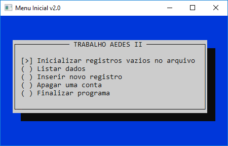
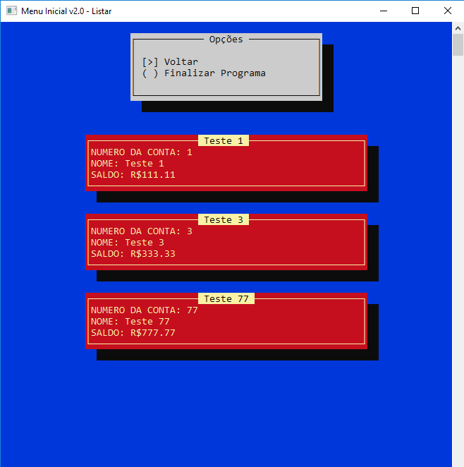

# Manipulação de Arquivo Binário com Campos de Tamanho Fixo
Um software simples que faz o CRUD de um TAD (unsigned int numeroConta, char nome[30], double saldo), referente a uma conta bancária, num arquivo binário (credito.dat) com capacidade de 100 registros de tamanho fixo.

**Palavras chave:** C, "windows.h", Interface Gráfica, Manipulação de arquivos, Arquivo Binário, Campos de tamanho Fixo





## Pré-requisitos
```
O código da Interface Gráfica baseia-se na biblioteca windows.h
Por isso só será executado corretamente em dispositivos com Sistema Operacional do Windows.
```

## Construído com
* [Code::Blocks](http://www.codeblocks.org/) - A IDE utilizada.

## Versões
VERSÃO 1.0.0 [22/05/2019]
* Manipulação de arquivo binário com capacidade de 100 registros de tamanho fixo.
* CRUD do TAD cliente.
* Interface Gráfica Simples.
* Falta implementar interface com campos para a adição e remoção de dados.

## Autores
* **Renan Zanoti** - *Trabalho de Algoritmo e Estrutura de Dados 2 (Sistemas de Informação, UFOP - ICEA)* - [renanzan](https://github.com/renanzan)
